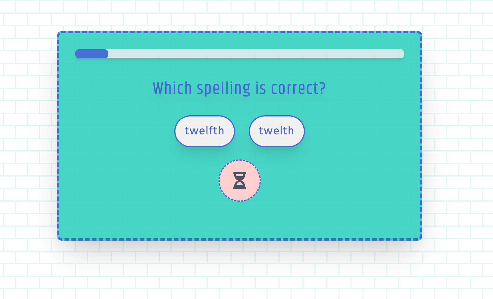

# 

[**PLAY IT HERE**](https://volkanungan.github.io/spelling-quiz/)

#### A spelling game that I created to practice:

    🟧 React
    🟦 Tailwind
    🟨 Vite

It is both responsive and accessible.

I parsed the common misspellings from [Commonly misspelled English words article](https://en.wikipedia.org/wiki/Commonly_misspelled_English_words) at Wikipedia.
